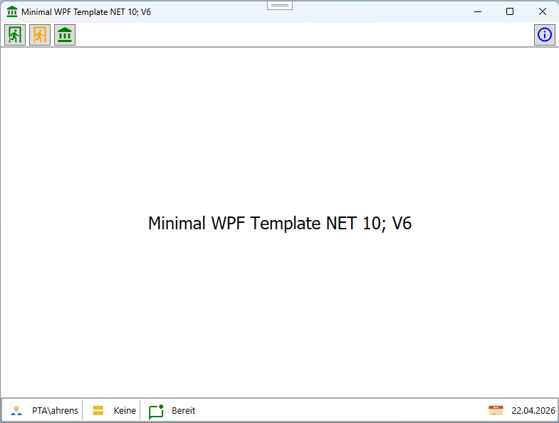

# MinimalWPF Projekt Template


Dieses Projekt ist ein einfaches WPF-Projekt Template für .NET 10.0, das die grundlegenden Komponenten für den Start einer WPF-Anwendung enthält. Es ist ideal für Entwickler, die schnell mit der Entwicklung von WPF-Anwendungen beginnen möchten.\



Das Template soll als Grundlage für die Entwicklung von WPF-Anwendungen dienen und enthält bereits einige nützliche Funktionen und Strukturen, die in vielen Anwendungen benötigt werden. Es ist so konzipiert, dass es leicht an die spezifischen Anforderungen eines Projekts angepasst werden kann.

Hauptaufgabe des Templates ist es, eine solide Basis für die Entwicklung von WPF-Anwendungen als Prototyp zu bieten, damit Entwickler sich auf die Implementierung der spezifischen Funktionen ihrer Anwendung konzentrieren können, anstatt Zeit mit der Einrichtung der grundlegenden Struktur zu verbringen.

# Installation
Die Verwendung des Template ist recht einfach, da dieses nur in ein Verzeichnis kopiert werden muss, damit es in Visual Studio als Vorlage zur Verfügung steht. 

`c:\_Documents\Visual Studio 18\Templates\ProjectTemplates\Visual C#\`

# Features des Template
- Inside MVVM (durch WindowsBase Klasse)
- Dialog Popup
- IconButton
- Localization
- Settings in JSON File (durch SettingsBase)
- Singleton Funktionalität (Threadsicher Zugriff auf Instanzen durch Lazy<T>) mit Initalisierung durch ISingletonInitializable Interface.

Alle Klassen für das Template sind unter dem Namespace `System.Windows` organisiert.

## WindowBase

Die Klasse WindowBase ist eine benutzerdefinierte Basisklasse für Fenster in der WPF-Anwendung. Sie bietet grundlegende Funktionalitäten und Eigenschaften, die von allen Fenstern in der Anwendung geerbt werden können. Dadurch wird die Wiederverwendbarkeit von Code erhöht und die Wartbarkeit der Anwendung verbessert.
```xml
<base:WindowBase
    x:Class="MinimalWPF.MainWindow"
    xmlns="http://schemas.microsoft.com/winfx/2006/xaml/presentation"
    xmlns:x="http://schemas.microsoft.com/winfx/2006/xaml"
    xmlns:base="clr-namespace:System.Windows"
    xmlns:d="http://schemas.microsoft.com/expression/blend/2008"
    xmlns:local="clr-namespace:MinimalWPF"
    xmlns:mc="http://schemas.openxmlformats.org/markup-compatibility/2006"
    Title="{Binding Path=WindowTitel, FallbackValue=~WindowTitel}"
    Width="900"
    Height="600"
    Icon="{StaticResource ResourceKey=IconCustomA2}"
    mc:Ignorable="d">

    <Grid x:Name="gridMain">

    </Grid>
</base:WindowBase>
```
## Windows Titel Icon
Die Methode `SetVectorIcon()` ermöglicht es, ein benutzerdefiniertes Icon für den Fenstertitel festzulegen. Das Icon wird in der Titelleiste des Fensters angezeigt und kann verwendet werden, um die Anwendung visuell zu identifizieren.
Die Besonderheit  ist, dass die Methode `SetVectorIcon()` es ermöglicht, ein Vektor-Icon zu verwenden das auf Basis eines `DrawingImage` erstellt wird, das in der XAML-Ressourcendatei definiert ist. Dadurch können skalierbare Icons verwendet werden, die unabhängig von der Auflösung des Bildschirms scharf bleiben.
```csharp
this.SetVectorIcon("AppIcon2", 64);
```

## Binding Properties
Mit `GetValue` und `SetValue` können Eigenschaften in der WindowBase-Klasse an ein WPF Property gebunden werden.
Die Implementierung von INotifyPropertyChanged entfällt, da diese bereits in der WindowBase-Klasse implementiert ist. 
```xml
<base:WindowBase
    <--- Das Property WindowTitel wird an Title gebunden --->
    Title="{Binding Path=WindowTitel, FallbackValue=~WindowTitel}"

</base:WindowBase>
```
```csharp
public string WindowTitel
{
    get => base.GetValue<string>();
    set => base.SetValue(value);
}
```

## CommandBase

Die CommmandBase Klasse ist eine benutzerdefinierte Implementierung des ICommand-Interfaces, die es ermöglicht, Befehle in der WPF-Anwendung zu erstellen und zu verwenden. Sie bietet eine einfache Möglichkeit, Aktionen an Benutzeroberflächenelemente zu binden, wie z.B. Schaltflächen oder Menüs.
```csharp
public MainWindow()
{
    this.QuitCommand = new CommandBase(this.OnQuit);
}

public CommandBase QuitCommand { get; private set; }

private void OnQuit()
{
    this.Tag = null;
    this.Close();
}
```

## Settings
Die SmartSettingsBase-Klasse bietet eine einfache Möglichkeit, Einstellungen in der WPF-Anwendung zu verwalten. Sie ermöglicht das Speichern und Laden von Einstellungen in einer JSON-Datei, was die Konfiguration der Anwendung erleichtert und die Benutzerfreundlichkeit verbessert.
```csharp
internal sealed class ApplicationSettings : SettingsBase
{
    public string Username { get; set; }
    public DateTime LetzterZugriff { get; set; }
    public bool FrageExit { get; set; }
}
```

```json
{
  "Username": "PTA\\ahrens",
  "LetzterZugriff": "2026-04-27T13:55:20.2908708+02:00",
  "FrageExit": true
}
```
Ein gute Stellen zum lesen der Einstellungen ist die `OnStartup()` Methode in der `App.xaml.cs` Klasse, da diese Methode aufgerufen wird, wenn das das Programm gestartet geladen wird. Dadurch können die Einstellungen direkt nach dem Laden angewendet werden.
Zum Speichern der Einstellungen kann die `OnExit()` Methode in der `App.xaml.cs` Klasse verwendet werden, da diese Methode aufgerufen wird, wenn das Programm geschlossen wird. Dadurch können die aktuellen Einstellungen vor dem Beenden der Anwendung gespeichert werden.


Die Settings werden unter `%AppData%\<Projektname>\Settings\Application.%username%.Setting` gespeichert.

## Localization

```xml
<system:String x:Key="WindowsTitelZeile">Minimal WPF Template NET 10; V6</system:String>
```

```csharp
this.WindowTitel = LocalizationString.Get("WindowsTitelZeile");
```

## Singleton

Die SingletonBase-Klasse bietet eine threadsichere Implementierung des Singleton-Musters. Sie stellt sicher, dass nur eine Instanz einer Klasse erstellt wird und bietet optional eine Initialisierung über das ISingletonInitializable-Interface.
Hinweis: Die Klasse muß einen `private` oder `protected` Konstruktor haben, damit die Instanzierung von außen verhindert wird.
```csharp
public class ConfigurationManager : SingletonBase<ConfigurationManager>, 
                                    ISingletonInitializable, 
                                    ISingletonReloadable
{
    protected ConfigurationManager()
    {
    }

    public string ApplicationName { get; private set; } = string.Empty;
    public DateTime LastReload { get; private set; }

    public void Initialize()
    {
        Debug.WriteLine("Initialisierung läuft...");

        // Beispielwerte erstellen
        this.LoadConfiguration();

        Debug.WriteLine("Initialisierung abgeschlossen");
    }

    public void Reload()
    {
        Console.WriteLine("Reload gestartet...");

        this.LoadConfiguration();

        Console.WriteLine("Reload abgeschlossen");
    }

    public void Print()
    {
        Debug.WriteLine($"App: {this.ApplicationName}");
        Debug.WriteLine($"Startup: {this.LastReload}");
    }

    private void LoadConfiguration()
    {
        // Simuliert Laden aus Datei/DB/API
        ApplicationName = $"App geladen: {DateTime.Now:T}";
        LastReload = DateTime.Now;
    }
}
```

Beispielhafte Verwendung der Singleton-Klasse ConfigurationManager. Beim ersten Zugriff auf die Instanz wird die Initialisierung automatisch durchgeführt, da die Klasse das ISingletonInitializable-Interface implementiert. Dadurch werden die Eigenschaften ApplicationName und StartupTime mit den entsprechenden Werten gefüllt, bevor sie verwendet werden.
```csharp
Debug.WriteLine("Vor erstem Zugriff");

var config = ConfigurationManager.Instance;

// Event abonnieren
config.Reloaded += () =>
{
    Console.WriteLine(">>> Reload Event abonniert");
};

config.Print();

Debug.WriteLine();
Debug.WriteLine("=== Reload ===");
Debug.WriteLine();

Thread.Sleep(2000);

ConfigurationManager.ReloadInstance();

Debug.WriteLine();

config.Print();
```

## StatusbarMain

Die statische Klasse StatusbarMain bietet eine zentrale Anlaufstelle für die Verwaltung der Statusleiste in der WPF-Anwendung. Sie enthält eine statische Instanz der Statusbar, die von verschiedenen Teilen der Anwendung verwendet werden kann, um Informationen anzuzeigen oder zu aktualisieren.
```xml
<!--#region Statuszeile-->
<StatusBar
    Grid.Row="2"
    Height="Auto"
    Background="Transparent"
    BorderBrush="DarkGray"
    BorderThickness="2"
    DataContext="StatusMain"
    FontSize="13">

    <StatusBarItem DockPanel.Dock="Left">
        <StackPanel Orientation="Horizontal">
            <Label Content="{StaticResource ResourceKey=IconStatusbarUser}" />
            <TextBlock
                Margin="5,0,0,0"
                VerticalAlignment="Center"
                Text="{Binding Path=CurrentUser, Source={x:Static base:StatusbarMain.Statusbar}}" />
        </StackPanel>
    </StatusBarItem>
</StatusBar>
<!--#endregion Statuszeile-->
```

Ändern eines Eintrags in der Statusleiste:
```csharp
StatusbarMain.Statusbar.DatabaseInfo = "Keine";
StatusbarMain.Statusbar.DatabaseInfoTooltip = "Keine Datenbank verbunden";
StatusbarMain.Statusbar.Notification = "Bereit";
```
# Versionshistorie

- Weitere Basis Klassen für das Template
  * Settings
  * DialogPopup
  * IconButton
  * Singleton


- Migration auf NET 10
